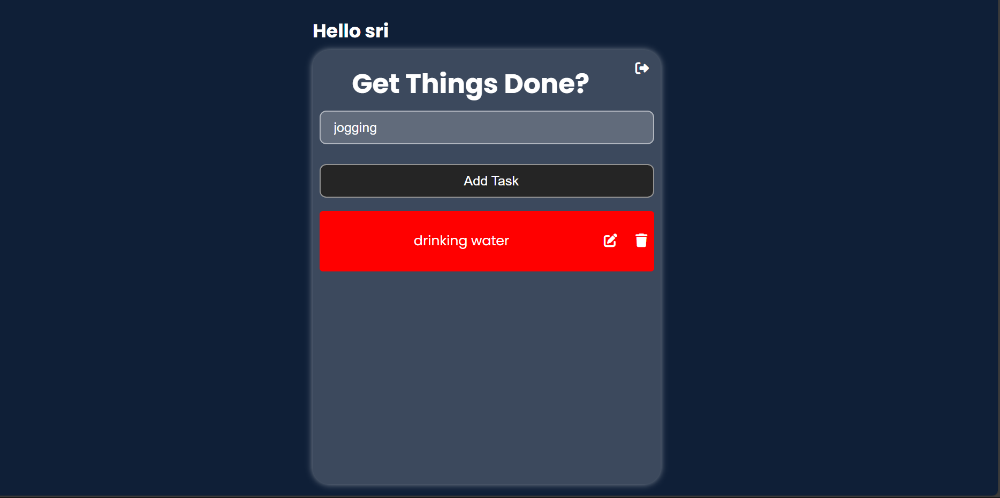

# Django To-Do List Application

This is a simple Django-based web application for managing a personal to-do list. The application allows users to sign up, log in, create, edit, delete, and view their to-do items. The project is built using Django's powerful features, including its ORM for database management and built-in authentication system.

## Table of Contents

- [Features](#features)
- [Installation](#installation)
- [Usage](#usage)
- [Project Structure](#project-structure)
- [Contributing](#contributing)
- [License](#license)

## Features

- **User Authentication**: Users can sign up, log in, and log out securely.
- **To-Do Management**: Create, view, edit, and delete to-do items.
- **User-Specific Data**: Each user's to-do list is unique and private.
- **Responsive Design**: The application is designed to work on both desktop and mobile devices.

## Installation

### Prerequisites

- Python 3.x
- Django 3.x or higher
- A virtual environment (recommended)

### Steps

1. **Clone the repository**:
2. **Create and activate a virtual environment**:
   ```bash
   python3 -m venv venv
   source venv/bin/activate
   ```

3. **Install the required dependencies**:
   ```bash
   pip install -r requirements.txt
   ```

4. **Apply the migrations**:
   ```bash
   python manage.py migrate
   ```

5. **Create a superuser (optional, for admin access)**:
   ```bash
   python manage.py createsuperuser
   ```

6. **Run the development server**:
   ```bash
   python manage.py runserver
   ```

7. **Access the application**:
   - Open your browser and navigate to `http://127.0.0.1:8000/`.

## Usage

### User Authentication

- **Sign Up**: Users can create an account by providing a username, email, and password.
- **Log In**: Users can log in with their credentials to access their to-do list.
- **Log Out**: Users can log out from their session at any time.

### To-Do Management

- **Create a To-Do Item**: Users can add a new to-do item by entering a title and submitting the form.
- **View To-Do Items**: The main to-do list page displays all to-do items for the logged-in user.
- **Edit a To-Do Item**: Users can edit the title of an existing to-do item.
- **Delete a To-Do Item**: Users can delete a to-do item they no longer need.

### Example Code Snippets

Here is how the user authentication is managed in the project:

```python
def signup(request):
    if request.method == 'POST':
        fnm = request.POST.get('fnm')
        emailid = request.POST.get('emailid')
        pwd = request.POST.get('pwd')
        my_user = User.objects.create_user(fnm, emailid, pwd)
        my_user.save()
        return redirect('/loginn')
    return render(request, 'signup.html')
```

## Project Structure

```
todo-app/
│
├── manage.py
├── db.sqlite3
├── README.md
├── requirements.txt
├── todo/
│   ├── migrations/
│   ├── static/
│   ├── templates/
│   │   ├── signup.html
│   │   ├── loginn.html
│   │   ├── todo.html
│   │   └── edit_todo.html
│   ├── __init__.py
│   ├── admin.py
│   ├── apps.py
│   ├── models.py
│   ├── tests.py
│   └── views.py
└── venv/
```


## Acknowledgements

A special thanks to the [Error By Night YouTube channel](https://www.youtube.com/watch?v=hWhWdf2gsfQ&t=3463s) for their invaluable tutorials and guidance. Their content played a significant role in helping to create and refine this project.

## Pictures




## Youtube video

 [Watch the demo video](https://youtu.be/OhmlKTe1Ds4)